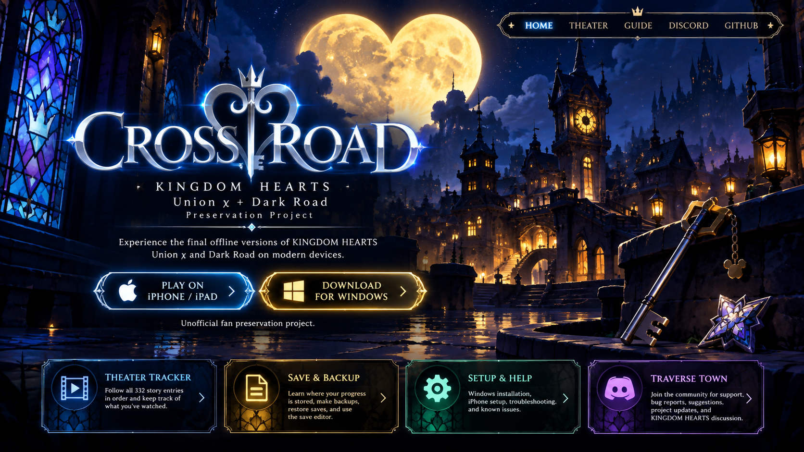

# CROSS ROAD

**KINGDOM HEARTS Union χ + Dark Road — iPhone/Web Preservation Build**

A mobile-friendly preservation build of the final offline version of KINGDOM HEARTS Union χ + Dark Road.

# [▶ PLAY NOW](https://qqclutchyqq.github.io/cross-road-ios/)

**iPhone/iPad:** Open the Play link in **Safari → Share → Add to Home Screen**.

**Game Content loads automatically.** You do not need to download, extract, or select the 2+ GB Content folder. Game data comes from the configured remote Content hosting and is cached on your device as needed.

[💬 Discord — Support & Bug Reports](https://discord.gg/jHWEkRdjJb) · [Beta release](https://github.com/qqCLUTCHYqq/cross-road-ios/releases/tag/v1.0.0-beta) · [What's new](CHANGELOG.md)

## Quick Start

### iPhone / iPad

1. Open [Play Cross Road](https://qqclutchyqq.github.io/cross-road-ios/) in **Safari**.
2. Tap **Share**.
3. Select **Add to Home Screen**.
4. Open **Cross Road** from your Home Screen, then tap **Launch game** if shown.
5. Choose **KHUX START** or **KHDR START**.

The first game data may take time to download and cache, depending on your connection. Keep an internet connection available: previously cached data can be reused, but uncached game data still needs to download.

No App Store installation, sideloading, or Apple Developer account is needed for this version.

## Save Data & Backups

Your normal progress is stored **locally on the device/browser you play on**. It is **not uploaded to GitHub or Cloudflare**. Use the game's normal save behavior; exporting is a separate backup, not the usual way to save progress.

**Make a backup:**

1. Open **••• → Stop game**.
2. Under **Save Data**, open **Back Up / Restore Save**.
3. Choose **Back Up / Export Save**.
4. Keep the exported file in **Files → On My iPhone** or **iCloud Drive**.

**Restore a backup:** Stop the game, open **••• → Back Up / Restore Save**, then choose **Restore / Import Save** and select your exported file. Importing replaces the current local progress, so back it up first if you want to keep it.

Progress should persist when you close and reopen Cross Road in the same browser/Home Screen app. Normal PWA updates are intended to preserve saves. However, clearing Safari website data can delete progress, and browser storage is not guaranteed to remain on iOS forever. Export a backup periodically, and before removing the app or clearing website data. Moving between browsers or devices does not automatically move your save.

## 💬 Discord — Support & Bug Reports

**[Join Traverse Town on Discord](https://discord.gg/jHWEkRdjJb)** — the project's community home and preferred place for installation help, bug reports, compatibility reports, feature suggestions, development updates, and preservation discussion.

For a useful bug report, include:

- Device model and iOS/iPadOS version.
- Safari tab or Home Screen app.
- KHUX or Dark Road.
- What you were doing, steps to reproduce, and what happened instead.
- A screenshot or short video if useful.
- **••• → Diagnostics → Copy Diagnostics / Export Diagnostics**, when available.

Review attachments before posting and remove personal information. Do not publicly upload a save file; only share one if it is specifically needed and you understand what it contains and who will receive it.

Prefer GitHub? [Open a bug report](https://github.com/qqCLUTCHYqq/cross-road-ios/issues/new?template=bug_report.md).

## Known Issues & Testing Notes

This is a **beta community preservation build**. The current build has been approved for public testing after physical-iPhone testing; this is not a guarantee for every device or OS version.

- Earlier iPhone tests reported native KHUX popup tap-through, stuck Close/Back controls, and stacked dimming. Resolution of those reports has not been separately confirmed for this beta.
- After switching apps or unlocking the phone, audio may need the first normal tap to resume.
- An internet connection is needed for game data that has not already been cached; a completely offline game library is not promised.
- Unusual device-specific iOS/WebKit behavior may still occur. Report new problems on [Discord](https://discord.gg/jHWEkRdjJb), ideally with diagnostics.

## Screenshots

Physical-iPhone screenshots will be added here. See [the screenshot folder](docs/screenshots/README.md) for the planned views. No promotional artwork or simulated iPhone screenshots are presented as device testing.

<!-- Add real, reviewed captures here when supplied:


-->

## Credits & Provenance

### Original Cross Road project — Arena7664

**Cross Road was originally created by [Arena7664](https://github.com/Arena7664), and this iPhone/Safari/PWA adaptation would not exist without that work.** The original Cross Road project is available at [Arena7664/CrossRoad](https://github.com/Arena7664/CrossRoad).

This repository builds on Arena7664's preserved Cross Road runtime and adapts the iPhone/Safari/Home Screen experience. Credit for the original Cross Road runtime and its underlying preservation work belongs to Arena7664 and the original contributors; this repository does not claim ownership of their work or the original game material.

The original runtime's **Thanks and Acknowledgements** remain intact, including KHTomorrow (Purple), Breezyfeather, the Albiel community, KHUxTools, Rellume, Emscripten, Vite, and Svelte. See [the preserved acknowledgements and technical history](TECHNICAL.md#credits-and-acknowledgements).

Original `Cross Road.zip` SHA-256:

```text
963DA2019A04327BFA6CD50F9A58A243AD351B61C56F63AFC4E1270DDB4997F7
```

The original archive remains untouched. No new license is applied to third-party Cross Road, game, or runtime material. Existing third-party notices and the historical ZIPFoundation acknowledgement are preserved.

## Legal / Disclaimer

**Unofficial fan preservation project.** Not affiliated with or endorsed by Square Enix or Disney. KINGDOM HEARTS and related intellectual property belong to their respective rights holders. This repository includes or interfaces with third-party preservation/runtime material for which this project does not claim ownership. See [LEGAL.md](LEGAL.md) for details.

## Technical / Preservation Documentation

- [PWA hosting, Content and storage notes](PWA.md)
- [Technical history, native iOS/IPA experiment and acknowledgements](TECHNICAL.md)
- [Changelog](CHANGELOG.md)
- [v1.0.0-beta release notes and runtime baseline](docs/releases/v1.0.0-beta.md)

Players can simply use **[▶ PLAY NOW](https://qqclutchyqq.github.io/cross-road-ios/)**. The native IPA experiment is historical and is not part of the normal installation.


